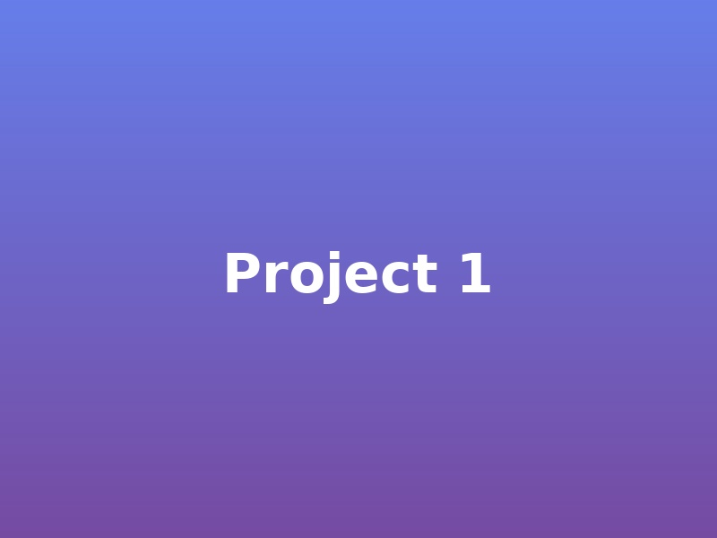

# Apple-Inspired Portfolio Website

A beautiful, modern single-page portfolio website inspired by Apple's design aesthetic, featuring smooth animations, an interactive water scene with a swimming otter, and sections for showcasing your projects and work experience.

## Features

✨ **Apple-Inspired Design** - Clean, minimalist aesthetic with smooth animations
🎨 **Fully Responsive** - Works perfectly on all devices
📱 **Single Page Application** - Smooth scrolling navigation
💼 **Project Showcase** - Display your best work with descriptions
📋 **Work Experience Timeline** - Professional experience in an elegant timeline
📄 **Resume Integration** - Modal popup to view/download your resume
🦦 **Animated Water Scene** - Fun swimming otter animation at the bottom
⚡ **Performance Optimized** - Fast loading and smooth interactions

## File Structure

```
portfolio/
├── index.html          # Main HTML file
├── styles.css          # All styling and animations
├── script.js           # Interactive functionality
├── resume.pdf          # Your resume (replace this)
├── project1.jpg        # Project 1 image (replace this)
├── project2.jpg        # Project 2 image (replace this)
├── project3.jpg        # Project 3 image (replace this)
└── README.md           # This file
```

## Quick Start

1. Extract all files to a folder
2. Open `index.html` in your web browser
3. Follow the customization guide below to add your information

## Step-by-Step Customization Guide

### 1. PERSONAL INFORMATION (index.html)

**Location: Hero Section (Lines 24-33)**

Replace:
```html
<h1 class="hero-title">Hello, I'm <span class="highlight">Your Name</span></h1>
<p class="hero-subtitle">Full Stack Developer & Creative Problem Solver</p>
<p class="hero-description">Building innovative solutions that make a difference</p>
```

With your information:
```html
<h1 class="hero-title">Hello, I'm <span class="highlight">John Doe</span></h1>
<p class="hero-subtitle">Senior Software Engineer & UI/UX Designer</p>
<p class="hero-description">Creating beautiful and functional web experiences</p>
```

**Location: Navigation Logo (Line 21)**
```html
<div class="logo">YourName</div>
```
Change to:
```html
<div class="logo">John Doe</div>
```

---

### 2. ABOUT ME SECTION (index.html)

**Location: Lines 47-73**

**Change the introduction text:**
```html
<p class="lead">I'm a passionate developer who loves creating elegant solutions to complex problems.</p>
<p>With expertise in modern web technologies and a keen eye for design...</p>
```

**Update your skills** (Lines 58-67):
Replace the skill items with your own:
```html
<div class="skill-item">JavaScript</div>
<div class="skill-item">React</div>
<!-- Add or remove skills as needed -->
```

**Update statistics** (Lines 71-85):
```html
<div class="stat-item">
    <h3>5+</h3>
    <p>Years Experience</p>
</div>
<!-- Update numbers to match your experience -->
```

---

### 3. PROJECTS SECTION (index.html)

**Location: Lines 93-180**

For each project, you need to update:

#### PROJECT 1 (Lines 96-114):

```html
<div class="project-card">
    <div class="project-image">
          <!-- Replace with your image -->
    </div>
    <div class="project-info">
        <h3 class="project-title">E-Commerce Platform</h3>  <!-- Your project name -->
        <p class="project-description">
            A full-stack e-commerce solution...  <!-- Your project description -->
        </p>
        <div class="project-tags">
            <span class="tag">React</span>  <!-- Your technologies -->
            <span class="tag">Node.js</span>
            <!-- Add/remove tags as needed -->
        </div>
        <div class="project-links">
            <a href="#" class="project-link">View Demo</a>  <!-- Your demo link -->
            <a href="#" class="project-link">GitHub</a>     <!-- Your GitHub link -->
        </div>
    </div>
</div>
```

**To add your own project:**
1. Replace `src="project1.jpg"` with your project image filename
2. Update project title
3. Write your project description
4. Update technology tags
5. Add your demo and GitHub links

**Repeat for PROJECT 2 (Lines 117-138) and PROJECT 3 (Lines 141-162)**

**To add more projects:** Copy the entire `<div class="project-card">...</div>` block and paste it below, then customize.

---

### 4. WORK EXPERIENCE SECTION (index.html)

**Location: Lines 189-270**

For each experience entry:

#### EXPERIENCE 1 (Lines 193-210):

```html
<div class="timeline-item">
    <div class="timeline-marker"></div>
    <div class="timeline-content">
        <div class="timeline-header">
            <h3>Senior Full Stack Developer</h3>  <!-- Your job title -->
            <span class="company">Tech Innovations Inc.</span>  <!-- Company name -->
            <span class="period">2022 - Present</span>  <!-- Date range -->
        </div>
        <div class="timeline-body">
            <p>Leading development of enterprise-level web applications...</p>  <!-- Job summary -->
            <ul>
                <li>Reduced application load time by 60%...</li>  <!-- Your achievements -->
                <li>Implemented CI/CD pipeline...</li>
                <li>Led migration to cloud infrastructure...</li>
                <li>Mentored team of 5 junior developers</li>
            </ul>
        </div>
    </div>
</div>
```

**To customize:**
1. Update job title
2. Update company name
3. Update date range
4. Write your job summary
5. List your key achievements (add or remove `<li>` items as needed)

**Repeat for EXPERIENCE 2 (Lines 213-232) and EXPERIENCE 3 (Lines 235-252)**

**To add more experiences:** Copy a complete `<div class="timeline-item">...</div>` block and customize it.

---

### 5. CONTACT INFORMATION (index.html)

**Location: Lines 279-295**

Update your contact details:

```html
<div class="contact-icon">📧</div>
<div class="contact-details">
    <h4>Email</h4>
    <p>your.email@example.com</p>  <!-- Your email -->
</div>
```

```html
<div class="contact-icon">📱</div>
<div class="contact-details">
    <h4>Phone</h4>
    <p>+1 (555) 123-4567</p>  <!-- Your phone -->
</div>
```

```html
<div class="contact-icon">📍</div>
<div class="contact-details">
    <h4>Location</h4>
    <p>San Francisco, CA</p>  <!-- Your location -->
</div>
```

**Update social media links** (Lines 297-301):
```html
<div class="social-links">
    <a href="https://linkedin.com/in/yourprofile" class="social-link">LinkedIn</a>
    <a href="https://github.com/yourusername" class="social-link">GitHub</a>
    <a href="https://twitter.com/yourhandle" class="social-link">Twitter</a>
</div>
```

---

### 6. ADDING YOUR RESUME

**Option 1: Replace the PDF**
1. Save your resume as `resume.pdf`
2. Place it in the same folder as `index.html`
3. The website will automatically use it

**Option 2: Use a different filename**
If your resume is named differently (e.g., `MyResume.pdf`):

1. Open `index.html`
2. Find lines 345-349:
```html
<div class="resume-actions">
    <a href="resume.pdf" download class="btn btn-primary">Download PDF</a>
    <iframe id="resumeViewer" src="resume.pdf" width="100%" height="600px"></iframe>
</div>
```
3. Change both instances of `resume.pdf` to your filename

---

### 7. ADDING PROJECT IMAGES

**Steps to add your project images:**

1. Prepare your images:
   - Recommended size: 800x600 pixels or similar aspect ratio (4:3)
   - Format: JPG or PNG
   - File size: Optimized (< 500KB each for best performance)

2. Save your images as:
   - `project1.jpg` (or .png)
   - `project2.jpg` (or .png)
   - `project3.jpg` (or .png)

3. Place them in the same folder as `index.html`

4. If using different filenames, update in `index.html`:
```html

```
Change to:
```html

```

---

### 8. CUSTOMIZING COLORS (styles.css)

**Location: Lines 9-17**

Change the color scheme by updating the CSS variables:

```css
:root {
    --primary-color: #0071e3;      /* Main blue color */
    --secondary-color: #1d1d1f;    /* Dark color */
    --text-color: #1d1d1f;         /* Text color */
    --light-text: #6e6e73;         /* Light gray text */
    --background: #fbfbfd;         /* Background color */
    --white: #ffffff;              /* White */
    --gradient-start: #0071e3;     /* Gradient start */
    --gradient-end: #00c3ff;       /* Gradient end */
}
```

**Popular color combinations:**

Modern Purple:
```css
--primary-color: #667eea;
--gradient-start: #667eea;
--gradient-end: #764ba2;
```

Vibrant Orange:
```css
--primary-color: #ff6b6b;
--gradient-start: #ff6b6b;
--gradient-end: #feca57;
```

Professional Green:
```css
--primary-color: #10b981;
--gradient-start: #10b981;
--gradient-end: #059669;
```

---

### 9. CUSTOMIZING THE HERO GRADIENT

**Location: styles.css, Line 111**

Change the hero section background:

```css
background: linear-gradient(135deg, #667eea 0%, #764ba2 100%);
```

Try these alternatives:
```css
/* Sunset */
background: linear-gradient(135deg, #ff6b6b 0%, #feca57 100%);

/* Ocean */
background: linear-gradient(135deg, #0077be 0%, #00d4ff 100%);

/* Forest */
background: linear-gradient(135deg, #134e5e 0%, #71b280 100%);

/* Night */
background: linear-gradient(135deg, #2c3e50 0%, #3498db 100%);
```

---

## Advanced Customization

### Adding More Projects

1. Copy this entire block from `index.html`:
```html
<div class="project-card">
    <div class="project-image">
        
    </div>
    <div class="project-info">
        <h3 class="project-title">Your Project Name</h3>
        <p class="project-description">Your description here</p>
        <div class="project-tags">
            <span class="tag">Tech 1</span>
            <span class="tag">Tech 2</span>
        </div>
        <div class="project-links">
            <a href="#" class="project-link">View Demo</a>
            <a href="#" class="project-link">GitHub</a>
        </div>
    </div>
</div>
```

2. Paste it in the Projects section
3. Customize with your project details
4. Add the corresponding image file

### Removing the Otter Animation

If you don't want the otter, in `index.html` find lines 318-338 and delete or comment out the otter HTML.

### Making the Contact Form Functional

The contact form currently shows an alert. To make it send emails:

1. Sign up for a service like Formspree, EmailJS, or use your own backend
2. In `script.js`, find the contact form handler (lines 32-47)
3. Replace the alert with an actual email sending API call

---

## Browser Compatibility

✅ Chrome (recommended)
✅ Firefox
✅ Safari
✅ Edge
✅ Mobile browsers

---

## Performance Tips

1. **Optimize images** before uploading:
   - Use tools like TinyPNG or ImageOptim
   - Target file size < 500KB per image

2. **Test loading speed**:
   - Use Chrome DevTools Lighthouse
   - Aim for 90+ performance score

3. **Consider hosting**:
   - GitHub Pages (free)
   - Netlify (free)
   - Vercel (free)

---

## Deployment

### GitHub Pages (Free)

1. Create a GitHub repository
2. Upload all files
3. Go to Settings > Pages
4. Select main branch
5. Your site will be live at `https://yourusername.github.io/repository-name`

### Netlify (Free)

1. Drag and drop your folder to netlify.com
2. Your site is live instantly
3. Get a free subdomain or use your own

---

## Troubleshooting

**Problem:** Resume doesn't load
- **Solution:** Make sure `resume.pdf` is in the same folder as `index.html`

**Problem:** Images don't show
- **Solution:** Check that image filenames in HTML match actual file names (case-sensitive)

**Problem:** Smooth scrolling doesn't work
- **Solution:** Make sure `script.js` is loaded correctly

**Problem:** Otter doesn't animate
- **Solution:** Check browser console for JavaScript errors

---

## Credits

- Design inspired by Apple's website aesthetic
- Built with vanilla HTML, CSS, and JavaScript
- Icons: Emoji (native browser support)
- Fonts: System fonts for optimal performance

---

## Support

For questions or issues, feel free to:
- Check the HTML comments in the code
- Review this README thoroughly
- Test in different browsers

---

## License

Free to use for personal and commercial projects. Attribution appreciated but not required.

---

**Made with ❤️ and lots of coffee**

Enjoy your new portfolio website! 🚀